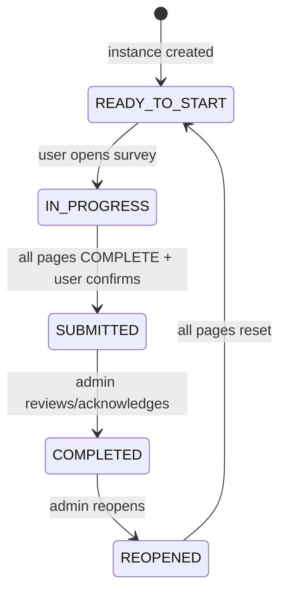
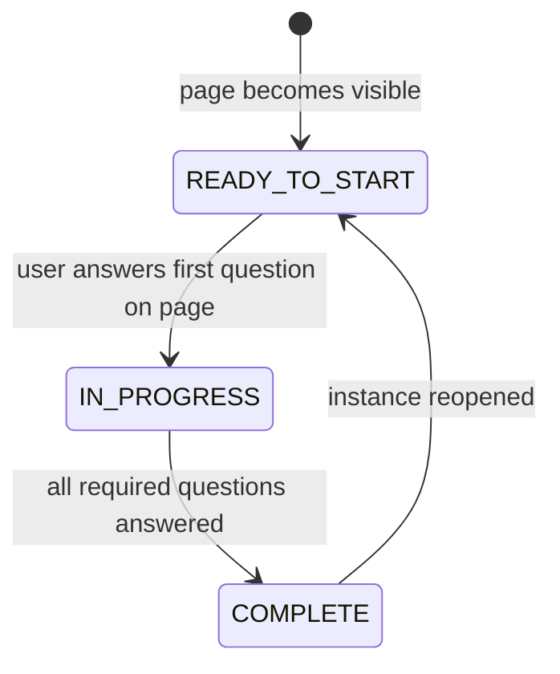

# Survey System — Design Spec

**Date:** 2026-06-20
**Status:** Approved
**Priority:** Post-MVP v1.1 (after Multi-tenancy)

---

## 1. Overview

Enterprise survey/questionnaire system integrated with the ticket management platform. Admin creates survey templates with multi-page, multi-section structure and conditional visibility logic, distributes instances to users, and analyzes results.

### 1.1 Key Features

| Feature | Description |
|---------|------------|
| Template Builder | Pages → Sections → Questions hierarchy with drag/click editing |
| 9 Question Types | Single/Multi choice, Text, Textarea, Date, Dropdown, Cascader, Rating, Table |
| Conditional Visibility | Rule-based show/hide at Page/Section/Question level with AND/OR logic |
| Instance Distribution | Ticket-triggered (post-close) or manual admin distribution to users/roles |
| Multi-page Fill | Left nav progress + right content layout, auto-save per page |
| Result Analytics | Aggregated stats (charts for choice Qs, lists for text Qs), export to Excel |
| Template Lifecycle | Clone, versioning, import/export, DRAFT/PUBLISHED/ARCHIVED flow |
| Notifications | Reuses existing WebSocket + bell notification system |
| Email Reminders | Deferred to separate email infrastructure project |

### 1.2 Roles

| Role | Capabilities |
|------|-------------|
| Admin | Create/edit/publish/archive templates, distribute instances, view results |
| Agent | Fill surveys assigned to them |
| User | Fill surveys assigned to them |

---

## 2. Data Model

### 2.1 Entity Relationship

```
SurveyTemplate (1) ──→ (*) SurveyPage (*) ──→ (*) SurveySection (*) ──→ (*) SurveyQuestion
       │                       │                       │                        │
       │                       │                       │                        │
       │                       └── (*) visibility_rules (target_type=PAGE)       │
       │                       └── (*) visibility_rules (target_type=SECTION)   │
       │                       └── (*) visibility_rules (target_type=QUESTION)  │
       │
       └── (*) SurveyInstance (1) ──→ (*) SurveyAnswer
                    │
                    └── (*) SurveyInstancePage (page-level status tracking)
```

### 2.2 Tables

#### survey_template

```sql
CREATE TABLE survey_template (
    id                  BIGINT NOT NULL AUTO_INCREMENT,
    title               VARCHAR(255) NOT NULL,
    description         TEXT DEFAULT NULL,
    status              VARCHAR(20) NOT NULL DEFAULT 'DRAFT',  -- DRAFT | PUBLISHED | ARCHIVED
    version             INT NOT NULL DEFAULT 1,
    origin_id           BIGINT DEFAULT NULL,                     -- points to v1 template ID; NULL = is v1
    allow_resubmit      TINYINT NOT NULL DEFAULT 0,             -- can user edit after submit?
    created_by          BIGINT NOT NULL,
    created_date        BIGINT NOT NULL,
    last_modified_by    BIGINT DEFAULT NULL,
    last_modified_date  BIGINT DEFAULT NULL,
    PRIMARY KEY (id),
    INDEX idx_template_status (status)
) ENGINE=InnoDB DEFAULT CHARSET=utf8mb4 COLLATE=utf8mb4_unicode_ci;
```

#### survey_page

```sql
CREATE TABLE survey_page (
    id                  BIGINT NOT NULL AUTO_INCREMENT,
    template_id         BIGINT NOT NULL,
    title               VARCHAR(255) NOT NULL,
    display_order       INT NOT NULL DEFAULT 0,
    created_by          BIGINT NOT NULL,
    created_date        BIGINT NOT NULL,
    last_modified_by    BIGINT DEFAULT NULL,
    last_modified_date  BIGINT DEFAULT NULL,
    PRIMARY KEY (id),
    FOREIGN KEY (template_id) REFERENCES survey_template(id) ON DELETE CASCADE,
    INDEX idx_page_template (template_id, display_order)
) ENGINE=InnoDB DEFAULT CHARSET=utf8mb4 COLLATE=utf8mb4_unicode_ci;
```

#### survey_section

```sql
CREATE TABLE survey_section (
    id                  BIGINT NOT NULL AUTO_INCREMENT,
    page_id             BIGINT NOT NULL,
    title               VARCHAR(255) NOT NULL,
    description         TEXT DEFAULT NULL,
    display_order       INT NOT NULL DEFAULT 0,
    created_by          BIGINT NOT NULL,
    created_date        BIGINT NOT NULL,
    last_modified_by    BIGINT DEFAULT NULL,
    last_modified_date  BIGINT DEFAULT NULL,
    PRIMARY KEY (id),
    FOREIGN KEY (page_id) REFERENCES survey_page(id) ON DELETE CASCADE,
    INDEX idx_section_page (page_id, display_order)
) ENGINE=InnoDB DEFAULT CHARSET=utf8mb4 COLLATE=utf8mb4_unicode_ci;
```

#### survey_question

```sql
CREATE TABLE survey_question (
    id                  BIGINT NOT NULL AUTO_INCREMENT,
    section_id          BIGINT NOT NULL,
    type                VARCHAR(20) NOT NULL,                      -- SINGLE_CHOICE | MULTI_CHOICE | TEXT | TEXTAREA | DATE | DROPDOWN | CASCADER | RATING | TABLE
    title               VARCHAR(500) NOT NULL,
    description         TEXT DEFAULT NULL,
    options             JSON DEFAULT NULL,                         -- type-specific config (choices, columns, levels, etc.)
    required            TINYINT NOT NULL DEFAULT 0,
    display_order       INT NOT NULL DEFAULT 0,
    created_by          BIGINT NOT NULL,
    created_date        BIGINT NOT NULL,
    last_modified_by    BIGINT DEFAULT NULL,
    last_modified_date  BIGINT DEFAULT NULL,
    PRIMARY KEY (id),
    FOREIGN KEY (section_id) REFERENCES survey_section(id) ON DELETE CASCADE,
    INDEX idx_q_section (section_id, display_order)
) ENGINE=InnoDB DEFAULT CHARSET=utf8mb4 COLLATE=utf8mb4_unicode_ci;
```

#### survey_visibility_rule

```sql
CREATE TABLE survey_visibility_rule (
    id                  BIGINT NOT NULL AUTO_INCREMENT,
    template_id         BIGINT NOT NULL,                          -- denormalized for fast loading
    target_type         VARCHAR(10) NOT NULL,                     -- PAGE | SECTION | QUESTION
    target_id           BIGINT NOT NULL,                          -- target page/section/question ID
    source_question_id  BIGINT NOT NULL,                          -- the question whose answer triggers this rule
    op                  VARCHAR(15) NOT NULL,                     -- eq | neq | in | contains | gt | gte | lt | lte | answered | not_answered
    value               VARCHAR(500) DEFAULT NULL,                -- comparison value (NULL for answered/not_answered)
    logic_group         INT NOT NULL DEFAULT 0,                   -- conditions in same group = AND, different groups = OR
    display_order       INT NOT NULL DEFAULT 0,
    created_by          BIGINT NOT NULL,
    created_date        BIGINT NOT NULL,
    last_modified_by    BIGINT DEFAULT NULL,
    last_modified_date  BIGINT DEFAULT NULL,
    PRIMARY KEY (id),
    INDEX idx_rule_target (template_id, target_type, target_id),
    INDEX idx_rule_source (source_question_id),
    FOREIGN KEY (source_question_id) REFERENCES survey_question(id) ON DELETE CASCADE
) ENGINE=InnoDB DEFAULT CHARSET=utf8mb4 COLLATE=utf8mb4_unicode_ci;
```

#### survey_instance

```sql
CREATE TABLE survey_instance (
    id                  BIGINT NOT NULL AUTO_INCREMENT,
    template_id         BIGINT NOT NULL,
    title               VARCHAR(255) NOT NULL,                     -- instance title (may differ from template)
    status              VARCHAR(20) NOT NULL DEFAULT 'READY_TO_START',  -- READY_TO_START | IN_PROGRESS | SUBMITTED | COMPLETED | REOPENED
    assigned_to         BIGINT NOT NULL,                           -- target user ID
    trigger_type        VARCHAR(20) NOT NULL,                      -- TICKET | MANUAL
    ticket_id           BIGINT DEFAULT NULL,                       -- NULL for manual distribution
    created_by          BIGINT NOT NULL,
    created_date        BIGINT NOT NULL,
    last_modified_by    BIGINT DEFAULT NULL,
    last_modified_date  BIGINT DEFAULT NULL,
    PRIMARY KEY (id),
    FOREIGN KEY (template_id) REFERENCES survey_template(id),
    INDEX idx_instance_user (assigned_to),
    INDEX idx_instance_status (status)
) ENGINE=InnoDB DEFAULT CHARSET=utf8mb4 COLLATE=utf8mb4_unicode_ci;
```

#### survey_instance_page

```sql
CREATE TABLE survey_instance_page (
    id              BIGINT NOT NULL AUTO_INCREMENT,
    instance_id     BIGINT NOT NULL,
    page_id         BIGINT NOT NULL,
    status          VARCHAR(20) NOT NULL DEFAULT 'READY_TO_START',  -- READY_TO_START | IN_PROGRESS | COMPLETE | REOPEN
    PRIMARY KEY (id),
    UNIQUE KEY uk_instance_page (instance_id, page_id),
    FOREIGN KEY (instance_id) REFERENCES survey_instance(id) ON DELETE CASCADE
) ENGINE=InnoDB DEFAULT CHARSET=utf8mb4 COLLATE=utf8mb4_unicode_ci;
```

#### survey_answer

```sql
CREATE TABLE survey_answer (
    id              BIGINT NOT NULL AUTO_INCREMENT,
    instance_id     BIGINT NOT NULL,
    question_id     BIGINT NOT NULL,
    value           JSON NOT NULL,                                   -- answer value (JSON to support all types)
    PRIMARY KEY (id),
    UNIQUE KEY uk_answer (instance_id, question_id),
    FOREIGN KEY (instance_id) REFERENCES survey_instance(id) ON DELETE CASCADE,
    FOREIGN KEY (question_id) REFERENCES survey_question(id) ON DELETE CASCADE
) ENGINE=InnoDB DEFAULT CHARSET=utf8mb4 COLLATE=utf8mb4_unicode_ci;
```

---

## 3. Question Types & Options Schema

### 3.1 Type Enumeration

```json
{
  "SINGLE_CHOICE": {"options": ["A", "B", "C"]},
  "MULTI_CHOICE":  {"options": ["A", "B", "C"], "max": 3},
  "TEXT":           {},
  "TEXTAREA":       {},
  "DATE":           {},
  "DROPDOWN":      {"options": ["A", "B", "C"]},
  "CASCADER":       {"levels": [{"key":"region","label":"区域"},...], "data": [...]},
  "RATING":         {"min": 1, "max": 5, "labels": ["非常不满意", "非常满意"]},
  "TABLE":          {"columns": [...], "rows": 5, "rowLabels": [...]}
}
```

### 3.2 Table Column Types

```json
{
  "columns": [
    {"key": "item",    "label": "事项",     "type": "TEXT"},
    {"key": "impact",  "label": "影响范围",  "type": "DROPDOWN", "options": ["低","中","高"]},
    {"key": "owner",   "label": "负责人",    "type": "TEXT"},
    {"key": "date",    "label": "完成日期",  "type": "DATE"}
  ]
}
```

Column types extensible via JSON; currently supports: `TEXT | DROPDOWN | DATE | NUMBER`.

### 3.3 Cascader Data

```json
{
  "levels": [
    {"key": "region", "label": "区域"},
    {"key": "country", "label": "国家"},
    {"key": "city", "label": "城市"}
  ],
  "data": [
    {
      "value": "asia", "label": "亚洲",
      "children": [
        {
          "value": "cn", "label": "中国",
          "children": [
            {"value": "beijing", "label": "北京"},
            {"value": "shanghai", "label": "上海"}
          ]
        }
      ]
    }
  ]
}
```

---

## 4. Visibility Rules

### 4.1 Structure

A single `survey_visibility_rule` row represents one condition. Multiple rows targeting the same `target_type + target_id` form a composite rule.

**Logic group semantics:**
- Same `logic_group` → AND
- Different `logic_group` → OR

### 4.2 Example

"Show Section A when (Q5 = 'P0' AND Q2 is answered) OR Q3 > 3"

```
Row 1: target_type=SECTION, target_id=<A>, source=Q5, op=eq,   value="P0", logic_group=0
Row 2: target_type=SECTION, target_id=<A>, source=Q2, op=answered, value=NULL, logic_group=0
Row 3: target_type=SECTION, target_id=<A>, source=Q3, op=gt,   value="3",  logic_group=1
```

### 4.3 Supported Operators

| Operator | Type | Description |
|----------|------|-------------|
| `eq` | String/Number | Value equals |
| `neq` | String/Number | Value not equals |
| `in` | Array | Value in set (for multi_choice) |
| `contains` | String | String contains substring |
| `gt` | Number | Greater than |
| `gte` | Number | Greater than or equal |
| `lt` | Number | Less than |
| `lte` | Number | Less than or equal |
| `answered` | Any | Question has been answered (value ignored) |
| `not_answered` | Any | Question has not been answered (value ignored) |

### 4.4 Dependency Graph & Recalculation

At template publish time, build a dependency map:
```
Q5 → [rule for Page3, rule for SectionA, rule for Q12]
Q2 → [rule for SectionA]
Q3 → [rule for SectionA]
```

At runtime:
1. User answers/changes Q5 → find Q5's dependent rules → re-evaluate only those
2. If a target becomes hidden → clear its answers → check if those answers trigger other rules → recurse
3. Cycle detection at template save time (e.g., Q5 controls Page3, Q12 in Page3 controls Q5 → reject)

### 4.5 Perf Boundaries

| Scale | Strategy |
|-------|---------|
| ≤ 50 questions | Direct full evaluation, no perf concern |
| 50-200 questions | Dependency graph + incremental recalculation |
| > 200 questions | Consider splitting into separate surveys |
| All scales | Lazy DOM rendering: only current page rendered |

---

## 5. State Machines

### 5.1 Instance States



| State | Description |
|-------|------------|
| `READY_TO_START` | Instance distributed, user hasn't started |
| `IN_PROGRESS` | User has started filling |
| `SUBMITTED` | User submitted; all mandatory questions answered |
| `COMPLETED` | Admin reviewed and finalized |
| `REOPENED` | Admin reopened for revision; pages reset |

### 5.2 Page States



Section states are computed at runtime (not persisted):
- VISIBLE / HIDDEN (from visibility rules)
- Section is COMPLETE when all its visible required questions are answered

---

## 6. Template Lifecycle

### 6.1 Actions by Status

| Status | Available Actions |
|--------|------------------|
| DRAFT | Edit · Publish · Clone · New Version · Export · Delete |
| PUBLISHED | View Results · View Instances · Distribute · Clone · New Version · Export · Archive |
| ARCHIVED | View Results · Clone · Export |

### 6.2 Clone

Creates a fully independent copy with new IDs. No link to the original. Used for creating similar templates quickly.

### 6.3 New Version

```
Click "New Version" on v1 (PUBLISHED)
  → Creates v2 with status=DRAFT, origin_id = v1.id
  → v1 remains PUBLISHED
  → Existing instances continue using v1
  → Publishing v2 automatically archives v1
  → New instances always use the PUBLISHED version
```

**Rule:** Only one PUBLISHED version per origin_id chain at any time.

### 6.4 Import / Export

Export: Download template structure as JSON (pages, sections, questions, visibility rules; NO instance data).
Import: Upload JSON → validate structure → create as DRAFT in current tenant.

Export JSON schema versioned (`exportVersion: "1.0"`) for forward compatibility.

---

## 7. UI Design

### 7.1 Admin: Template List

```
┌──────────────────────────────────────────────────────────┐
│  Survey Templates                        [+ New Template] │
├──────────────────────────────────────────────────────────┤
│  ┌──────────────────────────────────────────────────┐   │
│  │ 📋 P0 Postmortem Review               PUBLISHED  │   │
│  │    3 pages · 12 questions · Ticket-linked          │   │
│  │    Distributed 5 · Completed 3                     │   │
│  │    [Results] [Instances] [Edit] [Clone] [Archive]   │   │
│  └──────────────────────────────────────────────────┘   │
│  ┌──────────────────────────────────────────────────┐   │
│  │ 📋 Q2 Team Satisfaction Survey             DRAFT  │   │
│  │    2 pages · 8 questions · Standalone              │   │
│  │    [Edit] [Publish] [Clone] [Delete]                │   │
│  └──────────────────────────────────────────────────┘   │
└──────────────────────────────────────────────────────────┘
```

### 7.2 Admin: Template Builder (3-Column)

```
┌──────────┬─────────────────────────────┬────────────────┐
│ Structure │        Canvas (Preview)      │   Properties    │
│ Tree     │                              │                │
│         │  Page 1: Basic Info           │  Question Props │
│  + Page  │  ── Contact ── (Section)      │  Type: Radio    │
│  + Q    │   Name: [____]                │  Required: ☑    │
│         │   Dept:  [____]               │                │
│ 📄 Pg 1  │  ── Severity ── (Section)     │  Options:       │
│  📂Contact│   ○ P0  ○ P1  ○ P2           │    · P0         │
│   Q1 Name│  ── Detail ── (Section)       │    · P1  [drag] │
│   Q2 Dept│  ┌ Table ────────────────┐   │    · P2         │
│  📂Sev   │  │ Item  │Scope │Owner   │   │  [+ Add]        │
│   Q3 Sev │  │ ...   │ ...  │ ...    │   │                │
│ 📄 Pg 2  │  └───────────────────────┘   │  ── Visibility ──│
│         │                              │  When Q3 = "P0" │
│         │                              │  [+ Add Rule]   │
└──────────┴─────────────────────────────┴────────────────┘
```

### 7.3 User: Fill Page (Split Layout)

```
┌─────────────────────────────────────────────────────┐
│  ← Back        P0 Postmortem Review       Page 2/3 │
├─────────────┬───────────────────────────────────────┤
│             │                                       │
│ ● Basic Info │  ── Impact Scope ── (Section)          │
│ ◉ Analysis   │                                       │
│ ○ Actions    │  Severity *                            │
│             │  ○ P0  ○ P1  ○ P2                     │
│             │                                       │
│             │  ────────────────────────────          │
│             │                                       │
│             │  Affected Systems (Multi-choice)        │
│             │  ☑ User  ☑ Orders  ☐ Payments       │
│             │                                       │
│             │  ────────────────────────────          │
│             │                                       │
│             │  ▶ Impact Detail (Table — visible      │
│             │    only when Severity = P0)            │
│             │  ┌──────────────────────────┐         │
│             │  │ Item   │ Scope │ Owner   │         │
│             │  │ DB     │ High  │ Alice   │         │
│             │  └──────────────────────────┘         │
│             │                                       │
│             │                  [Previous] [Next]     │
└─────────────┴───────────────────────────────────────┘
```

**Left nav icons:** ✓ (complete), ◉ (current), ○ (not visited), — (hidden)

### 7.4 User: Dashboard Integration

Pending surveys shown as cards in existing Dashboard:

```
┌─────────────────────────────────────────────────────┐
│  Pending Surveys                         2 pending  │
├─────────────────────────────────────────────────────┤
│  ┌─────────────────────────────────────────────┐   │
│  │ 📋 P0 Postmortem Review                       │   │
│  │    Linked to Ticket #128 · Due 06/25 · 3 pages │   │
│  │    [Start Survey]                              │   │
│  └─────────────────────────────────────────────┘   │
│  ┌─────────────────────────────────────────────┐   │
│  │ 📋 Q2 Team Satisfaction Survey                 │   │
│  │    Standalone · Due 06/30 · 2 pages            │   │
│  │    [Start Survey]                              │   │
│  └─────────────────────────────────────────────┘   │
└─────────────────────────────────────────────────────┘
```

### 7.5 Admin: Results View

```
┌─────────────────────────────────────────────────────┐
│  ← Back        P0 Postmortem Review · Results       │
├─────────────────────────────────────────────────────┤
│  Overview: 5 distributed · 3 completed · 60% rate   │
├─────────────────────────────────────────────────────┤
│  ┌─ Q3: Severity (Single Choice) ─────────────────┐ │
│  │  P0 ████████████ 2 (67%)                       │ │
│  │  P1 ██████ 1 (33%)                              │ │
│  │  P2 0                                           │ │
│  └────────────────────────────────────────────────┘ │
│                                                     │
│  ┌─ Q5: Suggestions (Text) ──────────────────────┐ │
│  │  📝 Add monitoring alerts — Alice               │ │
│  │  📝 Improve rollback plan — Bob                 │ │
│  └────────────────────────────────────────────────┘ │
├─────────────────────────────────────────────────────┤
│  [View by Instance]  [Export Excel]                  │
└─────────────────────────────────────────────────────┘
```

---

## 8. Multi-tenancy Note

All survey tables MUST be created with a `tenant_id` column and included in the MyBatis-Plus tenant isolation plugin. This project depends on v1.1 Multi-tenancy being completed first.

---

## 9. Notifications

### 8.1 Integration

Reuses existing notification infrastructure (WebSocket + bell + DB, Feature 3).

| Event | Recipient | Notification |
|-------|-----------|-------------|
| Instance created (manual) | Assigned user | "New survey: P0 Postmortem Review" |
| Instance created (ticket) | Ticket creator | "Survey for ticket #128: P0 Postmortem Review" |
| Submission confirmed | Admin | "User Alice submitted P0 Postmortem Review" |

### 8.2 Email (Deferred)

Email reminders will be handled by a separate `notification.email` infrastructure project, reusing the existing Kafka topic plan from CLAUDE.md.

---

### 8.3 Ticket-triggered Instance Creation

When a ticket transitions to `CLOSED` status:
1. `TicketServiceImpl.changeStatus()` publishes `ticket.closed` Kafka event
2. A survey-specific consumer checks if any PUBLISHED template has a trigger rule matching this ticket's category/priority/type
3. If matched: creates a `SurveyInstance` with `trigger_type=TICKET`, `ticket_id=<ticketId>`, `assigned_to=ticket.createdBy`
4. The assigned user receives a notification (bell + WebSocket)

Future: Admin configures trigger rules per template (ticket status, priority, category filters).

---

## 10. UX Checklist (ui-ux-pro-max compliance)

- [x] Touch targets ≥ 44×44px on all interactive elements (radio, checkbox, nav buttons)
- [x] `aria-label` on icon-only buttons and nav items
- [x] `aria-selected` on left nav page indicators
- [x] Visibility transitions use `opacity + max-height` (200ms, GPU-friendly)
- [x] Skeleton loading states for async content
- [x] Status colors paired with text labels (never color-only)
- [x] Error feedback: red border + "Please fill in this question" text
- [x] `cursor-pointer` on all clickable elements
- [x] Tab order matches visual order; hidden questions excluded from tab
- [x] `prefers-reduced-motion` respected
- [x] No emoji icons (use SVG for nav icons)

---

## 11. Implementation Order

1. **Prerequisite:** Multi-tenancy (v1.1) — all survey tables created with `tenant_id` from the start
2. DB migration: 7 tables
3. Entity + Mapper + DTO layer
4. Template CRUD + builder UI
5. Visibility engine (dependency graph + evaluation)
6. Instance distribution + state machines
7. Fill page (multi-page with auto-save)
8. Results analytics + export
9. Dashboard integration
10. Notifications integration

**Estimated total:** 25-30h
